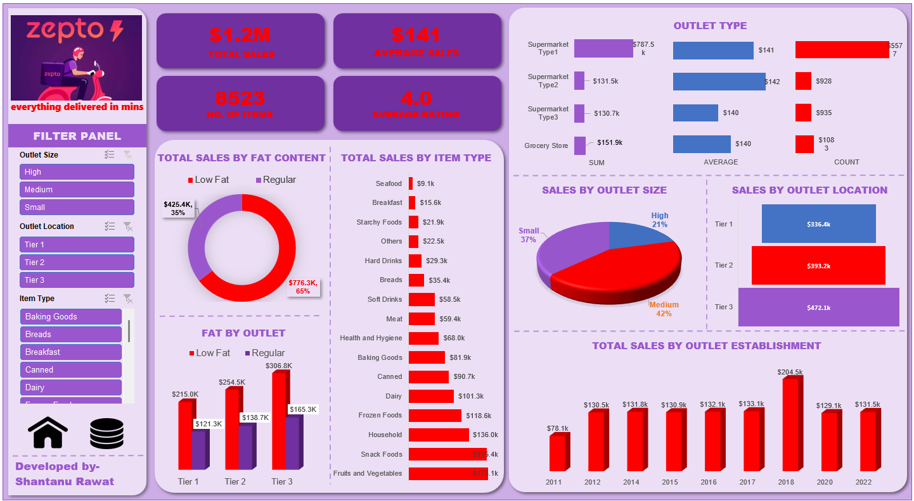

# Zepto Grocery Sales Dashboard (Excel)

## Project Overview

This project presents an interactive Excel dashboard analyzing grocery sales data from Zepto. The dashboard provides insights into sales performance, customer behavior, and product trends.

The objective was to transform raw data into meaningful insights using Excel tools such as pivot tables, charts, and data visualization techniques.

---

## Problem Statement

The goal was to analyze grocery sales data to understand:

- Sales performance across categories
- Customer purchasing patterns
- Product-level trends
- Key business metrics for decision-making

---

## Tools & Techniques Used

- Microsoft Excel
- Pivot Tables
- Pivot Charts
- Data Cleaning
- Data Visualization

---

## Key Features of the Dashboard

### 1. Sales Analysis

- Total sales performance overview
- Category-wise sales distribution
- Product-level insights

---

### 2. Customer Insights

- Purchase behavior patterns
- Frequency and trends in buying

---

### 3. Data Visualization

- Interactive charts and graphs
- Dynamic filtering using slicers (if used)

---

### 4. Dashboard Capabilities

- Easy-to-understand layout
- Interactive filtering
- Business-focused insights

---

## Key Insights

- Certain product categories contribute significantly to total sales
- Sales trends highlight peak demand periods
- Customer purchasing behavior shows recurring patterns
- Data-driven insights can help improve inventory and sales strategy

---

## Files in this Repository

- `zepto_grocery_dashboard.xlsx` – Excel dashboard with analysis and visualizations
- `dashboard.png` – Preview of the dashboard

---

## Author

Shantanu Rawat | Shantanu1tech@gmail.com | +91 9310315068
www.linkedin.com/in/shantanu-rawat-119047401